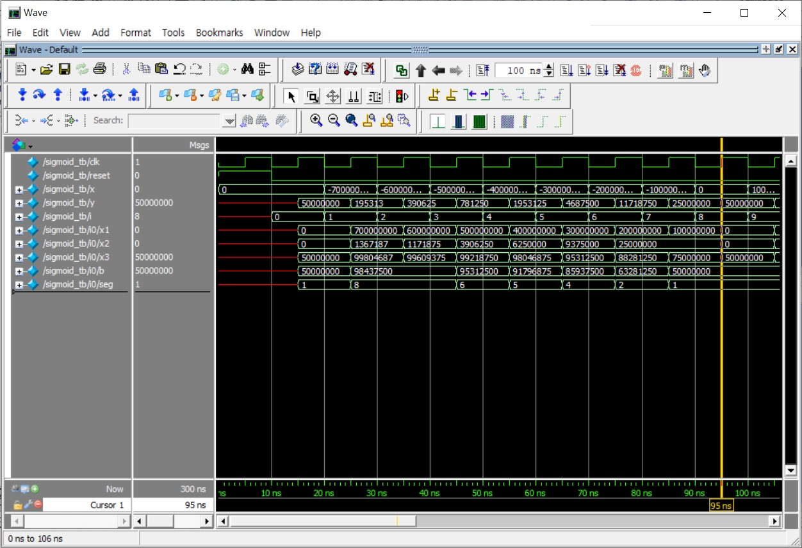

# Increasing Computational efficiency using FPGA

Increasing Computational efficiency using FPGA in **한국과학기술원 반도체설계교육센터 [(KAIST IDEC)](https://www.idec.or.kr/)**

**Solve Bottlenecks through Parallelism using FPGA with Verilog**
 In 2021 Increasing Computational efficiency using FPGA Lecture with KAIST IDEC

 

## Piecewise Line Segment About Sigmoid

- exponential function approximation method
- using shift-add method

| Lower Bound | Slope | Constant |
|:---:|:---:|:---:|
| 7.236 | 0 | 1.0 |
| 5.846 | 1/512 | 0.984375 |
| 5.147 | 1/256 | 0.97265625 |
| 4.442 | 1/128 | 0.953125 |
| 3.724 | 1/64 | 0.91796875 |
| 2.977 | 1/32 | 0.859375 |
| 2.164 | 1/16 | 0.765625 |
| 1.065 | 1/8 | 0.6328125 |
| 0.0 |  1/4 | 0.5 |
